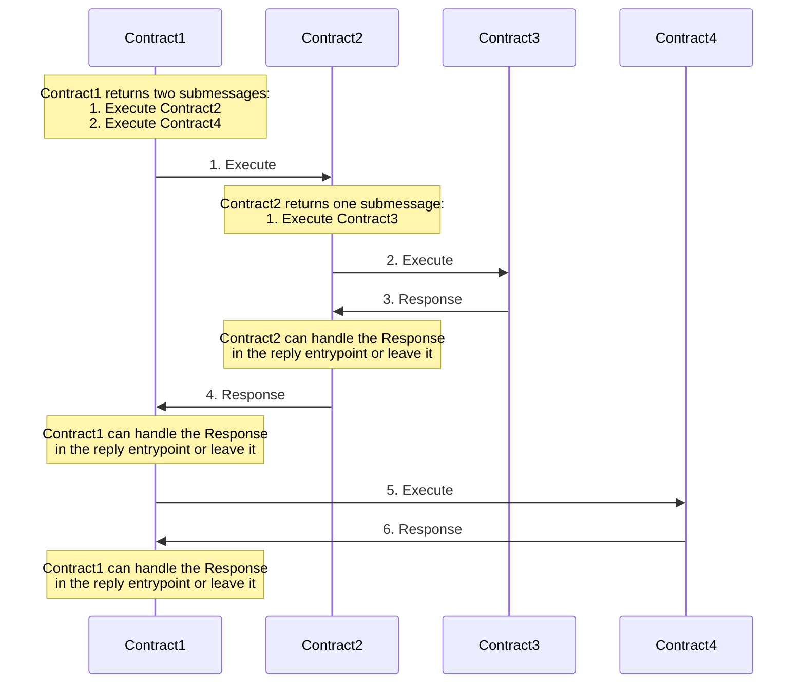

# Transactions

Every contract invocation is wrapped into a transaction. If you know about transactions in SQL
databases, you can consider them as the same basic concept. You execute multiple operations in a
single transaction, and if one of them fails, the whole transaction is rolled back.

In our case, these operations are invocations of contract entrypoints. If one of the invocations in
the chain fails, the whole transaction is usually rolled back. Failing in this context means that
the contract entrypoint returns an error or panics.

## Dispatching Submessages

Now let's move onto the `messages` field of the
[`Response`](https://docs.rs/cosmwasm-std/latest/cosmwasm_std/struct.Response.html). Some contracts
are fine only talking with themselves. But many want to move tokens or call into other contracts for
more complex actions. This is where messages come in. We return
[`CosmosMsg`](https://docs.rs/cosmwasm-std/latest/cosmwasm_std/enum.CosmosMsg.html), which is a
serializable representation of any external call the contract can make.

This may be hard to understand at first. "Why can't I just call another contract?", you may ask.
However, we do this to prevent one of the most widespread and hardest to detect security holes in
Ethereum contracts - reentrancy. We do this by following the actor model, which doesn't nest
function calls, but returns messages that will be executed later. This means all state that is
carried over between one call and the next happens in storage and not in memory. For more
information on this design, I recommend you read [our docs on the Actor Model](actor-model.mdx).

A common request was the ability to get the result from one of the messages you dispatched. For
example, you want to create a new contract with
[`WasmMsg::Instantiate`](https://docs.rs/cosmwasm-std/latest/cosmwasm_std/enum.WasmMsg.html#variant.Instantiate),
but then you need to store the address of the newly created contract in the caller. This is possible
with `messages` and replies. This makes use of
[`CosmosMsg`](https://docs.rs/cosmwasm-std/latest/cosmwasm_std/enum.CosmosMsg.html) as above, but it
wraps it inside a [`SubMsg`](https://docs.rs/cosmwasm-std/latest/cosmwasm_std/struct.SubMsg.html)
envelope.

What are the semantics of a submessage execution? First, we create a sub-transaction context around
the state, allowing it to read the latest state written by the caller, but write to yet-another
cache. If `gas_limit` is set, it is sandboxed to how much gas it can use until it aborts with
`OutOfGasError`. This error is caught and returned to the caller like any other error returned from
contract execution (unless it burned the entire gas limit of the transaction).

If it returns success, the temporary state is committed (into the caller's cache), and the
[`Response`](https://docs.rs/cosmwasm-std/latest/cosmwasm_std/struct.Response.html) is processed as
normal. Once the response is fully processed, this may then be intercepted by the calling contract
(for `ReplyOn::Always` and `ReplyOn::Success`). On an error, the subcall will revert any partial
state changes due to this message, but not revert any state changes in the calling contract. The
error may then be intercepted by the calling contract (for `ReplyOn::Always` and `ReplyOn::Error`).
In this case, the message's error doesn't abort the whole transaction.

Note, that error doesn't abort the whole transaction _if and only if_ the `reply` is called - so in
case of `ReplyOn::Always` and `ReplyOn::Error`. If the submessage is called with `ReplyOn::Success`
or `ReplyOn::Never`, the error in a subsequent call would result in failing whole transaction and
not commit the changes for it. The rule here is as follows: if for any reason you want your message
handling to succeed on submessage failure, you always have to reply on failure.

## Preventing rollbacks in case of failure

If you don't want your entire transaction to be rolled back in case of a failure, you can split the
logic into multiple messages. This can be two contracts, a contract executing itself or a contract
that sends a message to a Cosmos SDK module. Then use the `reply_on` field in the message you send.
Set the field to one of the following values and instead of rolling back the transaction, you will
receive a message containing the error:

- `ReplyOn::Always`
- `ReplyOn::Error`

That way you can handle the error and decide what to do next, whether you want to propagate the
error, retry the operation, ignore it, etc.

The default value `ReplyOn::Success` means the caller is not ready to handle an error in the message
execution and the entire transaction is reverted on error.

## Order of execution and rollback procedure

Submessages handling follows _depth first_ order rules. Let's see the following example scenario:

**Note1:** The
[msg_responses](https://docs.rs/cosmwasm-std/latest/cosmwasm_std/struct.SubMsgResponse.html#structfield.msg_responses)
of the response are not forwarded down the call path. It means that for e.g. if `Contract2` will not
explicitly handle response from `Contract3` and forward any data, then `Contract1` will never learn
about results from `Contract3`.

**Note2:** If `Contract2` returns an error, the error message can be handled by the `Contract1`
reply entry-point and prevent the whole transaction from rollback. In such a case only the
`Contract2` and `Contract3` states changes are reverted.
