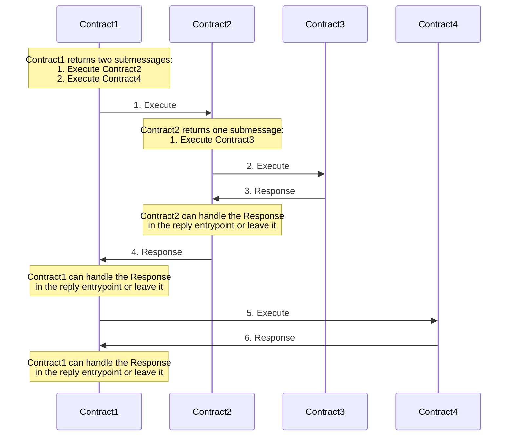

# Contract Semantics

This document provides a detailed explanation of the semantics governing the interaction between a
CosmWasm contract and its environment. Specifically, it distinguishes between two primary types of
actions: _mutating actions_, which modify the blockchain's state, and query actions, which are
executed with read-only access to the data.

## Definitions

**Contract** is a [WebAssembly](https://webassembly.org/) code stored in the blockchain's state.
This has no state except that which is contained in the binary code (eg. static constants).

**Instance** refers to a specific instantiation of a contract. It includes a reference to the
contract's binary as well as a state unique to the instance, which is initialized upon its creation.
This state is stored in the key-value store on the blockchain's state. Consequently, a reference to
the contract's binary, combined with a reference to the prefixed data store, uniquely identifies the
smart contract.

Example: we could upload a generic "ERC20 mintable" contract, and many people could create
independent instances based on the same bytecode, where the local data defines the token name, the
issuer, the max issuance, etc.

1. First you **create** a _contract_,
2. Then you **instantiate** an _instance_,
3. Finally users **invoke** the _instance_.

## Execution

In the section below, we will discuss how the `execute` call works, but the same semantics apply to
any other _mutating_ action - `instantiate`, `migrate`, `sudo`, etc.

### SDK Context

Before looking at CosmWasm, we should look at the semantics enforced by the blockchain framework we
integrate with - the [Cosmos SDK](https://v1.cosmos.network/sdk). It is based upon the
[Tendermint BFT](https://tendermint.com/core/) Consensus Engine. Let us first look how they process
transactions before they arrive in CosmWasm.

First, the Tendermint engine will seek 2/3+ consensus on a list of transactions to be included in
the next block. This is done _without executing them_. They are simply subjected to a minimal
pre-filter by the Cosmos SDK module, to ensure they are validly formatted transactions, with
sufficient gas fees, and signed by an account with sufficient fees to pay it. Notably, this means
many transactions that error may be included in a block.

Once a block is committed, the transactions are then fed to the Cosmos SDK sequentially in order to
execute them. Each one returns a result or error along with event logs, which are recorded in the
`TxResults` section of the next block. The `AppHash` (or merkle proof or blockchain state) after
executing the block is also included in the next block.

The Cosmos SDK `BaseApp` handles each transaction in an isolated context. It first verifies all
signatures and deducts the gas fees. It sets the "Gas Meter" to limit the execution to the amount of
gas paid for by the fees. Then it makes an isolated context to run the transaction. This allows the
code to read the current state of the chain (after the last transaction finished), but it only
writes to a cache, which may be committed or rolled back on error.

A transaction may consist of multiple messages and each one is executed in turn under the same
context and same gas limit. If all messages succeed, the context will be committed to the underlying
blockchain state and the results of all messages will be stored in the `TxResult`. If one message
fails, all later messages are skipped and all state changes are reverted. This is very important for
atomicity. That means Alice and Bob can both sign a transaction with 2 messages: Alice pays Bob 1000
ATOM, Bob pays Alice 50 ETH, and if Bob doesn't have the funds in his account, Alice's payment will
also be reverted. This is similar to how a database transaction typically works.

[`x/wasm`](https://github.com/CosmWasm/wasmd/tree/master/x/wasm) is a custom Cosmos SDK module,
which processes certain messages and uses them to upload, instantiate, and execute smart contracts.
It accepts a properly signed
[`CosmWasm message`](https://github.com/CosmWasm/wasmd/blob/master/proto/cosmwasm/wasm/v1/tx.proto),
routes it to [`Keeper`](https://github.com/CosmWasm/wasmd/blob/master/x/wasm/keeper/keeper.go),
which loads the proper smart contract and calls one of the entry-point on it. Note that this method
may either return a success (with data and events) or an error. In the case of an error here, it
will revert the entire transaction in the block.

In this document we focus on the `execute` entry-point implementation and call to show you the
execution flow if the smart contracts. For more information on how to create contract and define
other basic entry-points, check [the entrypoints section](entrypoints.mdx).

### Basic Execution

When we implement a contract, we provide the following entry point:

```rust template="core"
#[cfg_attr(not(feature = "library"), entry_point)]
pub fn execute(
    deps: DepsMut,
    env: Env,
    info: MessageInfo,
    msg: ExecuteMsg,
) -> StdResult<Response> {
  // [...]
  Ok(Response::new())
}
```

With [`DepsMut`](https://docs.rs/cosmwasm-std/latest/cosmwasm_std/struct.DepsMut.html), this can
read and write to the
[`Storage`](https://docs.rs/cosmwasm-std/latest/cosmwasm_std/trait.Storage.html), as well as use the
[`Api`](https://docs.rs/cosmwasm-std/latest/cosmwasm_std/trait.Api.html) to validate addresses, and
use [`QuerierWrapper`](https://docs.rs/cosmwasm-std/latest/cosmwasm_std/struct.QuerierWrapper.html)
to query the state of other contracts or native modules. Once it is done, it returns either
`Ok(Response)` or `Err(ContractError)`.

If it returns `Err`, this error is converted to a string representation, and it's returned to the
SDK module. _All state changes are reverted_ and `x/wasm` returns this error message, which will
_generally_ abort the transaction, and return the error message to the external caller.

If it returns `Ok`, the
[`Response`](https://docs.rs/cosmwasm-std/latest/cosmwasm_std/struct.Response.html) object is parsed
and processed.

In the Cosmos SDK, a transaction returns a number of events to the user, along with an optional data
"result". This result is hashed into the next block hash to be provable and can return some
essential state (although in general client apps rely on Events more). This result is more commonly
used to pass results between contracts or modules in the sdk.

### Dispatching Submessages

Now let's move onto the `messages` field of the
[`Response`](https://docs.rs/cosmwasm-std/latest/cosmwasm_std/struct.Response.html). Some contracts
are fine only talking with themselves. But many want to move tokens or call into other contracts for
more complex actions. This is where messages come in. We return
[`CosmosMsg`](https://docs.rs/cosmwasm-std/latest/cosmwasm_std/enum.CosmosMsg.html), which is a
serializable representation of any external call the contract can make.

This may be hard to understand at first. "Why can't I just call another contract?", you may ask.
However, we do this to prevent one of most widespread and hardest to detect security holes in
Ethereum contracts - reentrancy. We do this by following the actor model, which doesn't nest
function calls, but returns messages that will be executed later. This means all state that is
carried over between one call and the next happens in storage and not in memory. For more
information on this design, I recommend you read
[our docs on the Actor Model](architecture/actor-model.mdx).

A common request was the ability to get the result from one of the messages you dispatched. For
example, you want to create a new contract with
[`WasmMsg::Instantiate`](https://docs.rs/cosmwasm-std/latest/cosmwasm_std/enum.WasmMsg.html#variant.Instantiate),
but then you need to store the address of the newly created contract in the caller. This is possible
with `messages` and replies. This makes use of
[`CosmosMsg`](https://docs.rs/cosmwasm-std/latest/cosmwasm_std/enum.CosmosMsg.html) as above, but it
wraps it inside a [`SubMsg`](https://docs.rs/cosmwasm-std/latest/cosmwasm_std/struct.SubMsg.html)
envelope.

What are the semantics of a submessage execution? First, we create a sub-transaction context around
the state, allowing it to read the latest state written by the caller, but write to yet-another
cache. If `gas_limit` is set, it is sandboxed to how much gas it can use until it aborts with
`OutOfGasError`. This error is caught and returned to the caller like any other error returned from
contract execution (unless it burned the entire gas limit of the transaction).

If it return success, the temporary state is committed (into the caller's cache), and the
[`Response`](https://docs.rs/cosmwasm-std/latest/cosmwasm_std/struct.Response.html) is processed as
normal. Once the response is fully processed, this may then be intercepted by the calling contract
(for `ReplyOn::Always` and `ReplyOn::Success`). On an error, the subcall will revert any partial
state changes due to this message, but not revert any state changes in the calling contract. The
error may then be intercepted by the calling contract (for `ReplyOn::Always` and `ReplyOn::Error`).
In this case, the messages error doesn't abort the whole transaction.

Note, that error doesn't abort the whole transaction _if and only if_ the `reply` is called - so in
case of `ReplyOn::Always` and `ReplyOn::Error`. If the submessage is called with `ReplyOn::Success`
or `ReplyOn::Never`, the error in subsequent call would result in failing whole transaction and not
commit the changes for it. The rule here is as follows: if for any reason you want your message
handling to succeed on submessage failure, you always have to reply on failure.

#### Handling the reply

Let's introduce a new entry-point:

```rust filename="contract.rs" template="core"
#[cfg_attr(not(feature = "library"), entry_point)]
pub fn reply(deps: DepsMut, env: Env, reply: Reply) -> StdResult<Response> {
  // [...]
  Ok(Response::new())
}
```

Once the submessage handling is finished, the caller will get a chance to handle the result. It will
get the original `id` of the subcall and the `Result` of the execution, both success and error. Note
that it includes all events returned by the submessage, which applies to native sdk modules (like
Bank) as well as the contracts. If you need more state, you must save some local context to the
store (under the `id`) in the `execute` entry-point, and load it in `reply`.

The `reply` call may return `Err` itself, in which case it is treated like the caller errored, and
aborting the sub-transaction. However, on successful processing, `reply` may return a normal
[`Response`](https://docs.rs/cosmwasm-std/latest/cosmwasm_std/struct.Response.html), which will be
processed as normal - events added to the `EventManager`, and all `messages` dispatched as described
above. When `Err` is returned by a message handler, all changes made by the handler up to the reply
entry-point that returns the `Ok` response are reverted. More information can be found in the
following section.

The responses emitted by the submessage are gathered in the
[`msg_responses`](https://docs.rs/cosmwasm-std/latest/cosmwasm_std/struct.SubMsgResponse.html#structfield.msg_responses)
field of the
[SubMsgResponse](https://docs.rs/cosmwasm-std/latest/cosmwasm_std/struct.SubMsgResponse.html)
structure. **Wasmd** allows chains to translate a single contract message into multiple SDK
messages. In that case all the message responses from each are concatenated into this flattened
`Vec`.

#### Order of execution and rollback procedure

Submessages handling follow a _depth first_ order rules. Let's see the following example scenario:



**Note1:** The field `data` of the submessages field in the response are not forwarded down the call
path. It means that for e.g. if `Contract2` will not explicitly handle response from `Contract3` and
forward any data, then `Contract1` will never learn about results from `Contract3`.

**Note2:** If `Contract2` return an error, the error message can be handled by the `Contract1` reply
entry-point and prevent the whole transaction from rollback. In such a case only the `Contract2` and
`Contract3` states changes are reverted.

## Query Semantics

Until now, we have focused on the
[`Response`](https://docs.rs/cosmwasm-std/latest/cosmwasm_std/struct.Response.html) object, which
allows us to execute code in other contracts via the actor model. That is, each contract is run
sequentially. This is essential to avoid reentrancy, which is when calling into another contract can
change my state while I am in the middle of a transaction.

However, there are many times we need access to information from other contracts in the middle of
processing, such as determining the contract's bank balance before sending funds. To enable this, we
have exposed the _read only_
[`QuerierWrapper`](https://docs.rs/cosmwasm-std/latest/cosmwasm_std/struct.QuerierWrapper.html) to
enable in place calls in the middle of the execution. By making it read-only, we can prevent the
possibility of reentrancy, as the query cannot modify any state or execute our contract.

When we "make a query", we serialize a
[`QueryRequest` struct](https://docs.rs/cosmwasm-std/latest/cosmwasm_std/enum.QueryRequest.html) and
then pass that over FFI to the runtime, where it is interpreted in the `x/wasm` SDK module. This is
extensible with blockchain-specific custom queries.

## Sylvia

The goal of Sylvia library is to enhance user experience and simplify the process of creating smart
contracts. Once we learn how CosmWasm works it's good to spend some time on writing your contracts
without the serialization/deserialization overhead. For more info check the
[Sylvia docs here](../sylvia.mdx)
