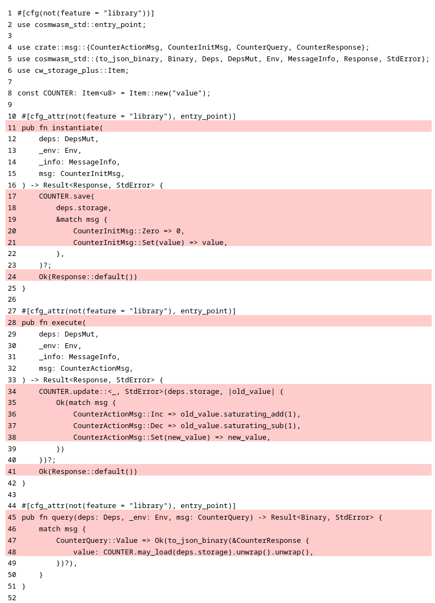
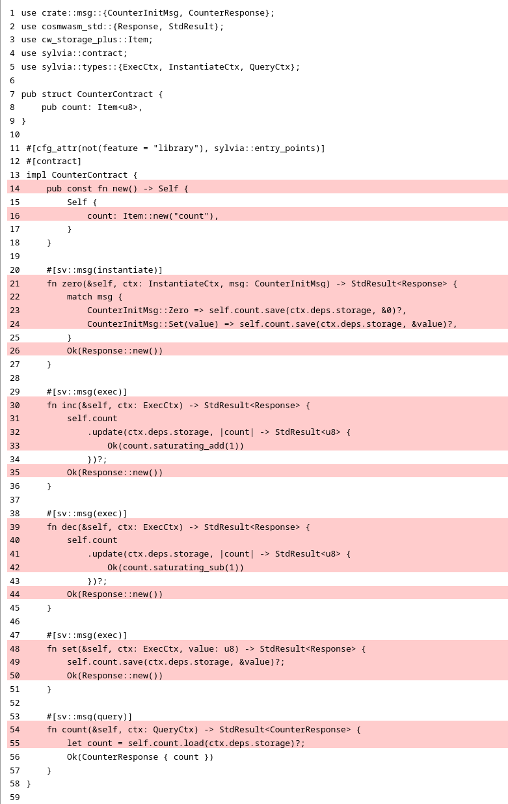

import { Callout, Cards, Card } from "nextra/components";

# Writing tests

(todo: place here some valuable introduction)

## Compiling the counter smart contract

Having the **counter** smart contract set up, let's first check if the project compiles:

```shell copy filename="TERMINAL"
cargo build
```

```ansi filename="OUTPUT"
 Updating crates.io index
  Locking 112 packages to latest compatible versions
    ⋮
Compiling cosmwasm-crypto v2.1.3
Compiling cosmwasm-std v2.1.3
Compiling cw-storage-plus v2.0.0
Compiling counter v0.1.0 (/home/user/my-contracts/counter)
 Finished `dev` profile [unoptimized + debuginfo] target(s) in 3.27s
```

If the output is similar to the one shown above, it looks like the **counter** smart contract has
been built successfully.

It is a very good habit to run [Rust linter](https://doc.rust-lang.org/clippy) after each code
change, so let's run it before we move forward.

```shell copy filename="TERMINAL"
cargo clippy
```

```ansi filename="OUTPUT"
    ⋮
Checking cosmwasm-crypto v2.1.3
Checking cosmwasm-std v2.1.3
Checking cw-storage-plus v2.0.0
Checking counter v0.1.0 (/home/user/mt-test-examples/mte-counter)
Finished `dev` profile [unoptimized + debuginfo] target(s) in 17.28s
```

Nice, `clippy` reported no issues for the **counter** smart contract.

## Preparing the directory structure for tests

Before we start writing tests, we need to set up the directories and files for the test cases. The
final directory and file structure is shown below.

```ansi showLineNumbers {7-11} filename="counter (directory)"
.
├── Cargo.toml
├── src
│   ├── contract.rs
│   ├── lib.rs
│   └── msg.rs
└── tests
    ├── mod.rs
    └── multitest
        ├── mod.rs
        └── test_counter.rs
```

<Callout>
  There are several configurations possible for placing tests in Rust, which are discussed in detail
  in [this chapter](best-practices#where-to-place-test-cases). For the purpose of this example, we
  have chosen to place all test cases outside **`src`** directory, in a new directory named
  **`tests`**.
</Callout>

<Callout>
  Note, that both directories **`src`** and **`tests`** are be placed at the root of the project (in
  `counter` directory).
</Callout>

Let's begin by creating the `tests` directory:

```shell copy filename="TERMINAL"
mkdir tests
```

Then create an empty `mod.rs` file inside the `tests` directory:

```shell copy filename="TERMINAL"
touch tests/mod.rs
```

Now, copy and paste the following content to `tests/mod.rs` file:

```rust copy filename="tests/mod.rs"
mod multitest;
```

By convention, we place all **`MultiTest`** test cases under the `multitest` directory, so let's
create it:

```shell copy filename="TERMINAL"
mkdir tests/multitest
```

Inside the `tests/multitest` directory we should also create an empty file named `mod.rs`:

```shell copy filename="TERMINAL"
touch tests/multitest/mod.rs
```

And populate it with the following content (just copy and paste):

```rust copy filename="tests/multitest/mod.rs"
mod test_counter;
```

Finally, inside the `tests/multitest` directory, we create a file named `test_counter.rs`:

```shell copy filename="TERMINAL"
touch tests/multitest/test_counter.rs
```

For now, we will leave this file empty, but later, we will place all our test cases there.

Now that the directory structure for tests is ready, it's time to run the tests.

## Running all tests for counter

Once the directories and files are set up for tests, let's execute them all:

```shell copy filename="TERMINAL"
cargo test
```

The expected output should be similar to the one shown below:

```ansi {6,12,16} showLineNumbers filename="OUTPUT"
    Finished `test` profile [unoptimized + debuginfo] target(s) in 17.96s
     Running unittests src/lib.rs (target/debug/deps/counter-f350df45a1cd1c74)

running 0 tests

test result: ok. 0 passed; 0 failed; 0 ignored; 0 measured; 0 filtered out; finished in 0.00s

     Running tests/mod.rs (target/debug/deps/mod-54761c1d31e6d0fe)

running 0 tests

test result: ok. 0 passed; 0 failed; 0 ignored; 0 measured; 0 filtered out; finished in 0.00s

   Doc-tests counter

running 0 tests

test result: ok. 0 passed; 0 failed; 0 ignored; 0 measured; 0 filtered out; finished in 0.00s
```

Rust testing framework searches for several types of tests in the project, counts all test cases and
executes them. In our example, while we haven't written any single test yet, there is nothing to
execute. The reported number of executed tests is zero for unit tests (**line 2**), zero for
integration tests (= **`MultiTest`** tests) (**line 12**) and zero for documentation tests
(**line16**).

Similarly, to execute all tests using [cargo-nextest](https://nexte.st), type:

```shell copy filename="TERMINAL"
cargo nextest run
```

The expected output is:

```ansi {4} showLineNumbers filename="OUTPUT"
    Finished `test` profile [unoptimized + debuginfo] target(s) in 0.06s
    Starting 0 tests across 2 binaries (run ID: 3e0cbabb-3ef9-4b2f-98a8-d375bc510845, nextest profile: default)
------------
     Summary [   0.000s] 0 tests run: 0 passed, 0 skipped
```

[cargo-nextest](https://nexte.st) reports in a user-friendly manner that there were no tests to run
(**line 4**).

Now, you have almost everything you need to start testing the **counter** smart contract. What’s
left is to prepare the tools for measuring code coverage, which is a handy way to track progress in
writing tests.

## Preparing the code coverage script

Typing the entire command for Tarpaulin every time you want to measure current code coverage can be
quite tedious, so let's prepare a short script to automate this task.

Create an empty file named `coverage.sh` in the `counter` directory:

```shell copy filename="TERMINAL"
touch coverage.sh
```

Populate it with the following content:

```shell copy filename="coverage.sh"
#!/usr/bin/env bash

# generate coverage report
cargo tarpaulin --force-clean --out Html --engine llvm --output-dir "$(pwd)/target/coverage-report"

# display link to coverage report
echo "Report: file://$(pwd)/target/coverage-report/tarpaulin-report.html"
```

Finally, make this file executable:

```shell filename="TERMINAL"
chmod +x coverage.sh
```

The complete file structure of the **counter** smart contract project, with the code coverage script
should now look like this:

```shell filename="TERMINAL"
tree
```

```ansi {3} filename="counter (directory)"
.
├── Cargo.toml
├── coverage.sh
├── src
│   ├── contract.rs
│   ├── lib.rs
│   └── msg.rs
└── tests
    ├── mod.rs
    └── multitest
        ├── mod.rs
        └── test_counter.rs
```

## Measuring code coverage

With the code coverage script at hand, measuring code coverage is now as simple as typing:

```shell copy filename="TERMINAL"
./coverage.sh
```

The result should be similar to this (only the last few lines are shown):

```ansi filename="OUTPUT"
⋮
|| Tested/Total Lines:
|| src/contract.rs: 0/18
||
0.00% coverage, 0/18 lines covered
Report: file:///home/user/counter/target/coverage-report/tarpaulin-report.html
```

Additionally, Tarpaulin generates a coverage report in HTML format, that can be viewed directly in a
browser.

<details>
  <summary>📃  Code coverage report for counter smart contract (CosmWasm version)</summary>
  
</details>

<details>
  <summary>📃  Code coverage report for counter smart contract (Sylvia version)</summary>
  
</details>

As expected, the current code coverage for the **counter** smart contract is 𝟎 since we haven't
written any tests yet. Follow the next chapters, and make the code coverage report shine green 🟢.

## Writing tests for smart contracts

<Callout type="info" emoji="🦘">
  Choose the card below to start testing the **counter** smart contract written using pure CosmWasm
  libraries or the Sylvia framework.
</Callout>

<Cards>
  <Card
    title="Writing tests for counter smart contract written using pure CosmWasm libraries"
    href="writing-tests/writing-tests-cosmwasm"
    icon=""
    children=""
  />
  <Card
    title="Writing tests for counter smart contract written using the Sylvia framework"
    href="writing-tests/writing-tests-sylvia"
    icon=""
    children=""
  />
</Cards>
