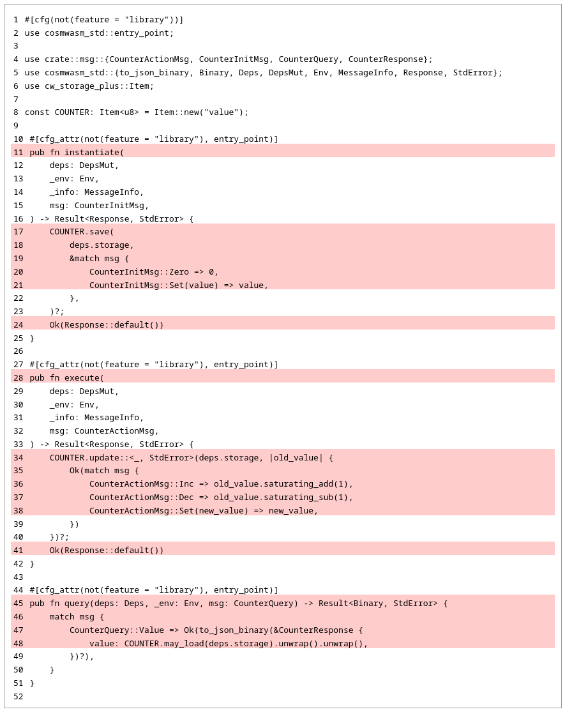

import { Callout, Cards, Card } from "nextra/components";

# Writing tests

(todo)

## Compiling the smart contract

Having the **counter** smart contract set up, let's first check if the project compiles:

```shell copy filename="TERMINAL"
cargo build
```

```ansi
 Updating crates.io index
  Locking 112 packages to latest compatible versions
    ⋮
Compiling cosmwasm-crypto v2.1.3
Compiling cosmwasm-std v2.1.3
Compiling cw-storage-plus v2.0.0
Compiling counter v0.1.0 (/home/user/my-contracts/counter)
 Finished `dev` profile [unoptimized + debuginfo] target(s) in 3.27s
```

If the output is similar to the one shown above, it looks like the **counter** smart contract has
been built successfully!

## Preparing directory structure for tests

Before we start writing tests, we need to set up the directories and files for the test cases. The
final directory and file structure is shown below.

```ansi showLineNumbers {7-11} filename="counter (directory)"
.
├── Cargo.toml
├── src
│   ├── contract.rs
│   ├── lib.rs
│   └── msg.rs
└── tests
    ├── mod.rs
    └── multitest
        ├── mod.rs
        └── test_counter.rs
```

<Callout>
  There are several configurations possible for placing tests in Rust, which are discussed in detail
  in [this chapter](best-practices#where-to-place-test-cases). For the purpose of this example, we
  have chosen to place all test cases outside **`src`** directory, in a new directory named
  **`tests`**.
</Callout>

<Callout>
  Note, that both directories **`src`** and **`tests`** are be placed at the root of the project (in
  `counter` directory).
</Callout>

Let's begin by creating the `tests` directory:

```shell copy filename="TERMINAL"
mkdir tests
```

Then create an empty `mod.rs` file inside the `tests` directory:

```shell copy filename="TERMINAL"
touch tests/mod.rs
```

Now, copy and paste the following content to `tests/mod.rs` file:

```rust copy filename="tests/mod.rs"
mod multitest;
```

By convention, we place all **`MultiTest`** test cases under the `multitest` directory, so let's
create it:

```shell copy filename="TERMINAL"
mkdir tests/multitest
```

Inside the `tests/multitest` directory we should also create an empty file named `mod.rs`:

```shell copy filename="TERMINAL"
touch tests/multitest/mod.rs
```

And populate it with the following content (just copy and paste):

```rust copy filename="tests/multitest/mod.rs"
mod test_counter;
```

Finally, inside the `tests/multitest` directory, we create a file named `test_counter.rs`:

```shell copy filename="TERMINAL"
touch tests/multitest/test_counter.rs
```

For now, we will leave this file empty, but later, we will place all our test cases there.

Now that the directory structure for tests is ready, it's time to run the tests.

## Running tests

Once the directories and files are set up for tests, let's run the tests:

```shell copy filename="TERMINAL"
cargo test
```

## Preparing code coverage script

```shell copy filename="TERMINAL"
touch coverage.sh
```

```shell copy filename="coverage.sh"
#!/usr/bin/env bash

# generate coverage report
cargo tarpaulin --force-clean --out Html --engine llvm --output-dir "$(pwd)/target/coverage-report"

# display link to coverage report
echo "Report: file://$(pwd)/target/coverage-report/tarpaulin-report.html"
```

```shell filename="TERMINAL"
chmod +x coverage.sh
```

```shell filename="TERMINAL"
tree
```

```ansi {3} filename="counter (directory)"
.
├── Cargo.toml
├── coverage.sh
├── src
│   ├── contract.rs
│   ├── lib.rs
│   └── msg.rs
└── tests
    ├── mod.rs
    └── multitest
        ├── mod.rs
        └── test_counter.rs
```

## Running tests and measuring code coverage

```shell copy filename="TERMINAL"
cargo test
```

```ansi
     Running unittests src/lib.rs (target/debug/deps/counter-f350df45a1cd1c74)

running 0 tests

test result: ok. 0 passed; 0 failed; 0 ignored; 0 measured; 0 filtered out; finished in 0.00s

     Running tests/mod.rs (target/debug/deps/mod-54761c1d31e6d0fe)

running 0 tests

test result: ok. 0 passed; 0 failed; 0 ignored; 0 measured; 0 filtered out; finished in 0.00s

   Doc-tests counter

running 0 tests

test result: ok. 0 passed; 0 failed; 0 ignored; 0 measured; 0 filtered out; finished in 0.00s
```

```shell copy filename="TERMINAL"
cargo nextest run
```

```ansi
    Starting 0 tests across 2 binaries (run ID: dbbc2d93-b077-47ea-81f2-9cdfea6fff1b, nextest profile: default)
------------
     Summary [   0.000s] 0 tests run: 0 passed, 0 skipped
```

```shell copy filename="TERMINAL"
./coverage.sh
```

```ansi
|| Tested/Total Lines:
|| src/contract.rs: 0/18
||
0.00% coverage, 0/18 lines covered
```



## Writing tests

(some introduction)

<Cards>
  <Card
    title="Writing tests for smart contracts written using pure CosmWasm"
    href="writing-tests/writing-tests-cosmwasm"
    icon=""
  >
    Writing tests in CosmWasm
  </Card>
  <Card
    title="Writing tests for smart contracts written using Sylvia framework"
    href="writing-tests/writing-tests-sylvia"
    icon=""
  >
    Writing tests in Sylvia
  </Card>
</Cards>
