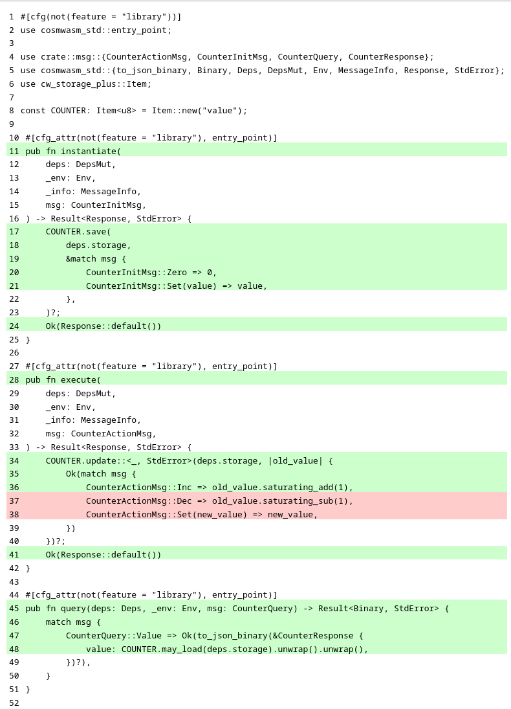
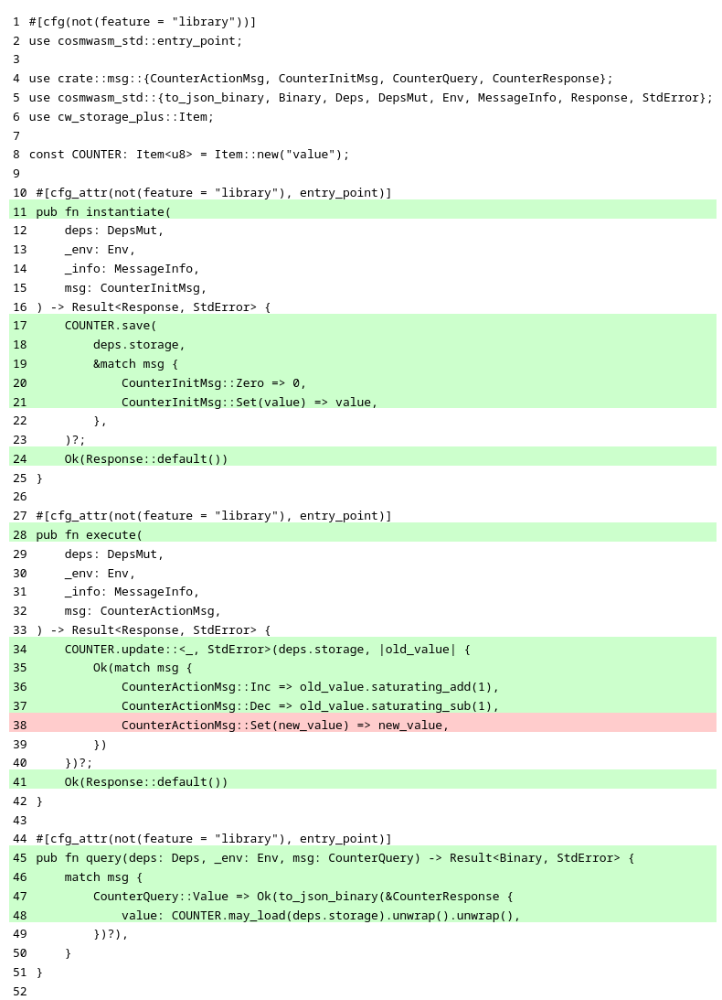
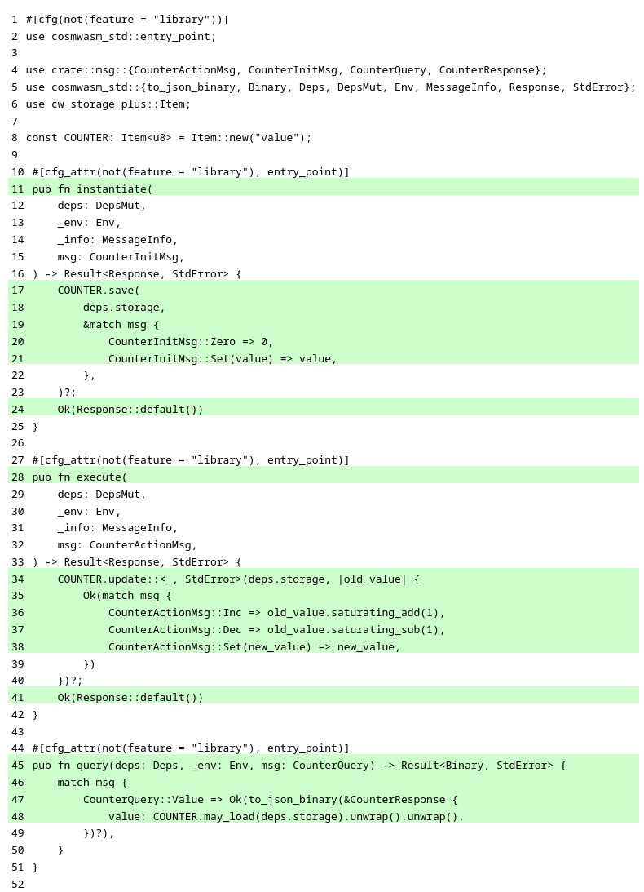

import { Callout, Card, Cards, Steps } from "nextra/components";

[cargo-nextest]: https://nexte.st

# Writing tests in CosmWasm

As a reminder, the file structure of the **counter** project is shown below. In this chapter, we
will be writing tests for this smart contract, which will be placed in a file named
`test_counter.rs`, highlighted in **line 12**.

```ansi {12} showLineNumbers filename="counter (directory)"
.
├── Cargo.toml
├── coverage.sh
├── src
│   ├── contract.rs
│   ├── lib.rs
│   └── msg.rs
└── tests
    ├── mod.rs
    └── multitest
        ├── mod.rs
        └── test_counter.rs
```

<Callout emoji="🏃">
  If you're in a hurry, at the end of this chapter, you can find the [final
  version](#test-cases-put-all-together) of the `test_counter.rs` file. Just copy and paste its
  content and run all tests.
</Callout>

## Imports

```rust copy showLineNumbers{1} filename="test_counter.rs"
use cosmwasm_std::Empty;
use counter::msg::{CounterActionMsg, CounterInitMsg, CounterQuery, CounterResponse};
use cw_multi_test::{App, Contract, ContractWrapper, Executor, IntoAddr};
```

## Wrapping the contact

```rust copy showLineNumbers{5} filename="test_counter.rs"
fn counter_contract() -> Box<dyn Contract<Empty>> {
    Box::new(ContractWrapper::new_with_empty(
        counter::contract::execute,
        counter::contract::instantiate,
        counter::contract::query,
    ))
}
```

## Testing counter initialization

### Testing initialization with zero

```rust copy showLineNumbers{13} filename="test_counter.rs"
#[test]
fn instantiating_with_zero_should_work() {
    let mut app = App::default();

    let code_id = app.store_code(counter_contract());

    let owner = "owner".into_addr();

    let contract_addr = app
        .instantiate_contract(
            code_id,
            owner,
            &CounterInitMsg::Zero,
            &[],
            "counter-label",
            None,
        )
        .unwrap();

    let res: CounterResponse = app
        .wrap()
        .query_wasm_smart(contract_addr, &CounterQuery::Value)
        .unwrap();

    assert_eq!(0, res.value);
}
```

Let's run the first test:

```shell copy filename="TERMINAL"
cargo test
```

The expected output should look like the example shown below. Note that only the results of
integration tests are shown. For brevity, the results of unit tests and documentation tests are
omitted, as we are focusing only on integration tests in this example.

```ansi filename="OUTPUT"
     Running tests/mod.rs (target/debug/deps/mod-319eb78408f3e46f)

running 1 test
test multitest::test_counter::instantiating_with_zero_should_work ... ok

test result: ok. 1 passed; 0 failed; 0 ignored; 0 measured; 0 filtered out; finished in 0.00s
```

Now, let's run all tests with [cargo-nextest]():

```shell copy filename="TERMINAL"
cargo nextest run
```

Similarly, one test passes:

```ansi filename="OUTPUT"
    Finished `test` profile [unoptimized + debuginfo] target(s) in 0.06s
    Starting 1 test across 2 binaries (run ID: bfc0013c-eb8e-447c-8027-a7c2b8c5cb80, nextest profile: default)
        PASS [   0.005s] counter::mod multitest::test_counter::instantiating_with_zero_should_work
------------
     Summary [   0.005s] 1 test run: 1 passed, 0 skipped
```

<Callout type="info" emoji="☉">
  For brevity, in the next test cases in this chapter, we will skip running tests using
  [cargo-nextest], although you can always just type `cargo nextest run` to run all tests with
  [cargo-nextest].
</Callout>

Ok, let's check the code coverage after adding the first test case:

```shell copy filename="TERMINAL"
./coverage.sh
```

```ansi filename="OUTPUT"
|| Tested/Total Lines:
|| src/contract.rs: 10/18
||
55.56% coverage, 10/18 lines covered
```

Our test case covered over 50% of the code of **counter** smart contract. The detailed code coverage
generated by Tarpaulin is attached below.

<details>
  <summary>📃  Code coverage report</summary>
  
</details>

#### Detailed explanation

<Cards>
  <Card
    title="🦘  Skip this time"
    href="#testing-initialization-with-a-specific-value"
    icon=""
    children=""
  />
</Cards>

(todo: extremely detailed explanation)

Topics to cover:

- `App::default{:rust}`
- `app.store_code{:rust}`
- `app.instantiate_contract{:rust}`

---

### Testing initialization with a specific value

```rust copy showLineNumbers{40} filename="test_counter.rs"
#[test]
fn instantiating_with_value_should_work() {
    let mut app = App::default();

    let code_id = app.store_code(counter_contract());

    let owner = "owner".into_addr();

    let contract_addr = app
        .instantiate_contract(
            code_id,
            owner,
            &CounterInitMsg::Set(12),
            &[],
            "counter-label",
            None,
        )
        .unwrap();

    let res: CounterResponse = app
        .wrap()
        .query_wasm_smart(contract_addr, &CounterQuery::Value)
        .unwrap();

    assert_eq!(12, res.value);
}
```

```shell copy filename="TERMINAL"
cargo test
```

```ansi filename="OUTPUT"
     Running tests/mod.rs (target/debug/deps/mod-319eb78408f3e46f)

running 2 tests
test multitest::test_counter::instantiating_with_zero_should_work ... ok
test multitest::test_counter::instantiating_with_value_should_work ... ok

test result: ok. 2 passed; 0 failed; 0 ignored; 0 measured; 0 filtered out; finished in 0.00s
```

```shell copy filename="TERMINAL"
./coverage.sh
```

```ansi filename="OUTPUT"
|| Tested/Total Lines:
|| src/contract.rs: 11/18
||
61.11% coverage, 11/18 lines covered
```

<details>
  <summary>📃  Code coverage report</summary>
  
</details>

#### Detailed explanation

<Cards>
  <Card title="🦘  Skip this time" href="#testing-increment-by-1" icon="" children="" />
</Cards>

(todo: extremely detailed explanation)

---

## Testing counter increment

### Testing increment by 1

```rust copy showLineNumbers{67} filename="test_counter.rs"
#[test]
fn incrementing_should_work() {
    let mut app = App::default();

    let code_id = app.store_code(counter_contract());

    let owner = "owner".into_addr();

    let contract_addr = app
        .instantiate_contract(
            code_id,
            owner.clone(),
            &CounterInitMsg::Zero,
            &[],
            "counter-contract",
            None,
        )
        .unwrap();

    app.execute_contract(owner, contract_addr.clone(), &CounterActionMsg::Inc, &[])
        .unwrap();

    let res: CounterResponse = app
        .wrap()
        .query_wasm_smart(contract_addr, &CounterQuery::Value)
        .unwrap();

    assert_eq!(1, res.value);
}
```

```shell copy filename="TERMINAL"
cargo test
```

```ansi filename="OUTPUT"
     Running tests/mod.rs (target/debug/deps/mod-319eb78408f3e46f)

running 3 tests
test multitest::test_counter::instantiating_with_zero_should_work ... ok
test multitest::test_counter::instantiating_with_value_should_work ... ok
test multitest::test_counter::incrementing_should_work ... ok

test result: ok. 3 passed; 0 failed; 0 ignored; 0 measured; 0 filtered out; finished in 0.00s
```

```shell copy copy filename="TERMINAL"
./coverage.sh
```

```ansi filename="OUTPUT"
|| Tested/Total Lines:
|| src/contract.rs: 16/18
||
88.89% coverage, 16/18 lines covered
```

<details>
  <summary>📃  Code coverage report</summary>
  
</details>

#### Detailed explanation

<Cards>
  <Card title="🦘  Skip this time" href="#testing-increment-overflow" icon="" children="" />
</Cards>

(todo: extremely detailed explanation)

---

### Testing increment overflow

```rust copy showLineNumbers{97} filename="test_counter.rs"
#[test]
fn incrementing_should_stop_at_maximum() {
    let mut app = App::default();

    let code_id = app.store_code(counter_contract());

    let owner = "owner".into_addr();

    let contract_addr = app
        .instantiate_contract(
            code_id,
            owner.clone(),
            &CounterInitMsg::Set(250),
            &[],
            "counter",
            None,
        )
        .unwrap();

    for _ in 1..=10 {
        app.execute_contract(
            owner.clone(),
            contract_addr.clone(),
            &CounterActionMsg::Inc,
            &[],
        )
        .unwrap();
    }

    let res: CounterResponse = app
        .wrap()
        .query_wasm_smart(contract_addr, &CounterQuery::Value)
        .unwrap();

    assert_eq!(255, res.value);
}
```

```shell copy filename="TERMINAL"
cargo test
```

```ansi filename="OUTPUT"
     Running tests/mod.rs (target/debug/deps/mod-319eb78408f3e46f)

running 4 tests
test multitest::test_counter::instantiating_with_zero_should_work ... ok
test multitest::test_counter::instantiating_with_value_should_work ... ok
test multitest::test_counter::incrementing_should_work ... ok
test multitest::test_counter::incrementing_should_stop_at_maximum ... ok

test result: ok. 4 passed; 0 failed; 0 ignored; 0 measured; 0 filtered out; finished in 0.00s
```

```shell copy filename="TERMINAL"
./coverage.sh
```

```ansi filename="OUTPUT"
|| Tested/Total Lines:
|| src/contract.rs: 16/18
||
88.89% coverage, 16/18 lines covered
```

<details>
  <summary>📃  Code coverage report</summary>
  
</details>

#### Detailed explanation

<Cards>
  <Card title="🦘  Skip this time" href="#testing-decrement-by-1" icon="" children="" />
</Cards>

(todo: extremely detailed explanation)

---

## Testing counter decrement

### Testing decrement by 1

```rust copy showLineNumbers{134} filename="test_counter.rs"
#[test]
fn decrementing_should_work() {
    let mut app = App::default();

    let code_id = app.store_code(counter_contract());

    let owner = "owner".into_addr();

    let contract_addr = app
        .instantiate_contract(
            code_id,
            owner.clone(),
            &CounterInitMsg::Set(126),
            &[],
            "counter-label",
            None,
        )
        .unwrap();

    app.execute_contract(owner, contract_addr.clone(), &CounterActionMsg::Dec, &[])
        .unwrap();

    let res: CounterResponse = app
        .wrap()
        .query_wasm_smart(contract_addr, &CounterQuery::Value)
        .unwrap();

    assert_eq!(125, res.value);
}
```

```shell copy filename="TERMINAL"
cargo test
```

```ansi filename="OUTPUT"
     Running tests/mod.rs (target/debug/deps/mod-319eb78408f3e46f)

running 5 tests
test multitest::test_counter::instantiating_with_zero_should_work ... ok
test multitest::test_counter::instantiating_with_value_should_work ... ok
test multitest::test_counter::incrementing_should_work ... ok
test multitest::test_counter::incrementing_should_stop_at_maximum ... ok
test multitest::test_counter::decrementing_should_work ... ok

test result: ok. 5 passed; 0 failed; 0 ignored; 0 measured; 0 filtered out; finished in 0.00s
```

```shell copy filename="TERMINAL"
./coverage.sh
```

```ansi filename="OUTPUT"
|| Tested/Total Lines:
|| src/contract.rs: 17/18
||
94.44% coverage, 17/18 lines covered
```

<details>
  <summary>📃  Code coverage report</summary>
  
</details>

#### Detailed explanation

<Cards>
  <Card title="🦘  Skip this time" href="#testing-decrement-underflow" icon="" children="" />
</Cards>

(todo: extremely detailed explanation)

---

### Testing decrement underflow

```rust copy showLineNumbers{164} filename="test_counter.rs"
#[test]
fn decrementing_should_stop_at_minimum() {
    let mut app = App::default();

    let code_id = app.store_code(counter_contract());

    let owner = "owner".into_addr();

    let contract_addr = app
        .instantiate_contract(
            code_id,
            owner.clone(),
            &CounterInitMsg::Set(5),
            &[],
            "counter-label",
            None,
        )
        .unwrap();

    for _ in 1..=10 {
        app.execute_contract(
            owner.clone(),
            contract_addr.clone(),
            &CounterActionMsg::Dec,
            &[],
        )
        .unwrap();
    }

    let res: CounterResponse = app
        .wrap()
        .query_wasm_smart(contract_addr, &CounterQuery::Value)
        .unwrap();

    assert_eq!(0, res.value);
}
```

```shell copy filename="TERMINAL"
cargo test
```

```ansi filename="OUTPUT"
     Running tests/mod.rs (target/debug/deps/mod-319eb78408f3e46f)

running 6 tests
test multitest::test_counter::instantiating_with_zero_should_work ... ok
test multitest::test_counter::instantiating_with_value_should_work ... ok
test multitest::test_counter::incrementing_should_work ... ok
test multitest::test_counter::incrementing_should_stop_at_maximum ... ok
test multitest::test_counter::decrementing_should_work ... ok
test multitest::test_counter::decrementing_should_stop_at_minimum ... ok

test result: ok. 6 passed; 0 failed; 0 ignored; 0 measured; 0 filtered out; finished in 0.00s
```

```shell copy filename="TERMINAL"
./coverage.sh
```

```ansi filename="OUTPUT"
|| Tested/Total Lines:
|| src/contract.rs: 17/18
||
94.44% coverage, 17/18 lines covered
```

<details>
  <summary>📃  Code coverage report</summary>
  
</details>

#### Detailed explanation

<Cards>
  <Card title="🦘  Skip this time" href="#testing-counter-value-changes" icon="" children="" />
</Cards>

(todo: extremely detailed explanation)

---

## Testing counter value changes

```rust copy showLineNumbers{201} filename="test_counter.rs"
#[test]
fn setting_value_should_work() {
    let mut app = App::default();

    let code_id = app.store_code(counter_contract());

    let owner = "owner".into_addr();

    let contract_addr = app
        .instantiate_contract(
            code_id,
            owner.clone(),
            &CounterInitMsg::Set(5),
            &[],
            "counter-label",
            None,
        )
        .unwrap();

    app.execute_contract(
        owner,
        contract_addr.clone(),
        &CounterActionMsg::Set(126),
        &[],
    )
    .unwrap();

    let res: CounterResponse = app
        .wrap()
        .query_wasm_smart(contract_addr, &CounterQuery::Value)
        .unwrap();

    assert_eq!(126, res.value);
}
```

```shell copy filename="TERMINAL"
cargo test
```

```ansi filename="OUTPUT"
     Running tests/mod.rs (target/debug/deps/mod-319eb78408f3e46f)

running 7 tests
test multitest::test_counter::instantiating_with_zero_should_work ... ok
test multitest::test_counter::instantiating_with_value_should_work ... ok
test multitest::test_counter::incrementing_should_work ... ok
test multitest::test_counter::incrementing_should_stop_at_maximum ... ok
test multitest::test_counter::decrementing_should_work ... ok
test multitest::test_counter::decrementing_should_stop_at_minimum ... ok
test multitest::test_counter::setting_value_should_work ... ok

test result: ok. 7 passed; 0 failed; 0 ignored; 0 measured; 0 filtered out; finished in 0.00s
```

```shell copy filename="TERMINAL"
./coverage.sh
```

```ansi filename="OUTPUT"
|| Tested/Total Lines:
|| src/contract.rs: 18/18
||
100.00% coverage, 18/18 lines covered
```

Nice, we have reached 💯% code coverage.

<details>
  <summary>📃  Code coverage report</summary>
  
</details>

#### Detailed explanation

<Cards>
  <Card title="🦘  Skip this time" href="#test-cases-put-all-together" icon="" children="" />
</Cards>

(todo: extremely detailed explanation)

---

## Test cases put all together

Below is the final version of the `test_counter.rs` file, containing all previously presented test
cases for **counter** smart contract written using pure CosmWasm libraries.

```rust copy showLineNumbers filename="test_counter.rs"
use cosmwasm_std::Empty;
use counter::msg::{CounterActionMsg, CounterInitMsg, CounterQuery, CounterResponse};
use cw_multi_test::{App, Contract, ContractWrapper, Executor, IntoAddr};

fn counter_contract() -> Box<dyn Contract<Empty>> {
    Box::new(ContractWrapper::new_with_empty(
        counter::contract::execute,
        counter::contract::instantiate,
        counter::contract::query,
    ))
}

#[test]
fn instantiating_with_zero_should_work() {
    let mut app = App::default();

    let code_id = app.store_code(counter_contract());

    let owner = "owner".into_addr();

    let contract_addr = app
        .instantiate_contract(
            code_id,
            owner,
            &CounterInitMsg::Zero,
            &[],
            "counter-label",
            None,
        )
        .unwrap();

    let res: CounterResponse = app
        .wrap()
        .query_wasm_smart(contract_addr, &CounterQuery::Value)
        .unwrap();

    assert_eq!(0, res.value);
}

#[test]
fn instantiating_with_value_should_work() {
    let mut app = App::default();

    let code_id = app.store_code(counter_contract());

    let owner = "owner".into_addr();

    let contract_addr = app
        .instantiate_contract(
            code_id,
            owner,
            &CounterInitMsg::Set(12),
            &[],
            "counter-label",
            None,
        )
        .unwrap();

    let res: CounterResponse = app
        .wrap()
        .query_wasm_smart(contract_addr, &CounterQuery::Value)
        .unwrap();

    assert_eq!(12, res.value);
}

#[test]
fn incrementing_should_work() {
    let mut app = App::default();

    let code_id = app.store_code(counter_contract());

    let owner = "owner".into_addr();

    let contract_addr = app
        .instantiate_contract(
            code_id,
            owner.clone(),
            &CounterInitMsg::Zero,
            &[],
            "counter-contract",
            None,
        )
        .unwrap();

    app.execute_contract(owner, contract_addr.clone(), &CounterActionMsg::Inc, &[])
        .unwrap();

    let res: CounterResponse = app
        .wrap()
        .query_wasm_smart(contract_addr, &CounterQuery::Value)
        .unwrap();

    assert_eq!(1, res.value);
}

#[test]
fn incrementing_should_stop_at_maximum() {
    let mut app = App::default();

    let code_id = app.store_code(counter_contract());

    let owner = "owner".into_addr();

    let contract_addr = app
        .instantiate_contract(
            code_id,
            owner.clone(),
            &CounterInitMsg::Set(250),
            &[],
            "counter",
            None,
        )
        .unwrap();

    for _ in 1..=10 {
        app.execute_contract(
            owner.clone(),
            contract_addr.clone(),
            &CounterActionMsg::Inc,
            &[],
        )
        .unwrap();
    }

    let res: CounterResponse = app
        .wrap()
        .query_wasm_smart(contract_addr, &CounterQuery::Value)
        .unwrap();

    assert_eq!(255, res.value);
}

#[test]
fn decrementing_should_work() {
    let mut app = App::default();

    let code_id = app.store_code(counter_contract());

    let owner = "owner".into_addr();

    let contract_addr = app
        .instantiate_contract(
            code_id,
            owner.clone(),
            &CounterInitMsg::Set(126),
            &[],
            "counter-label",
            None,
        )
        .unwrap();

    app.execute_contract(owner, contract_addr.clone(), &CounterActionMsg::Dec, &[])
        .unwrap();

    let res: CounterResponse = app
        .wrap()
        .query_wasm_smart(contract_addr, &CounterQuery::Value)
        .unwrap();

    assert_eq!(125, res.value);
}

#[test]
fn decrementing_should_stop_at_minimum() {
    let mut app = App::default();

    let code_id = app.store_code(counter_contract());

    let owner = "owner".into_addr();

    let contract_addr = app
        .instantiate_contract(
            code_id,
            owner.clone(),
            &CounterInitMsg::Set(5),
            &[],
            "counter-label",
            None,
        )
        .unwrap();

    for _ in 1..=10 {
        app.execute_contract(
            owner.clone(),
            contract_addr.clone(),
            &CounterActionMsg::Dec,
            &[],
        )
        .unwrap();
    }

    let res: CounterResponse = app
        .wrap()
        .query_wasm_smart(contract_addr, &CounterQuery::Value)
        .unwrap();

    assert_eq!(0, res.value);
}

#[test]
fn setting_value_should_work() {
    let mut app = App::default();

    let code_id = app.store_code(counter_contract());

    let owner = "owner".into_addr();

    let contract_addr = app
        .instantiate_contract(
            code_id,
            owner.clone(),
            &CounterInitMsg::Set(5),
            &[],
            "counter-label",
            None,
        )
        .unwrap();

    app.execute_contract(
        owner,
        contract_addr.clone(),
        &CounterActionMsg::Set(126),
        &[],
    )
    .unwrap();

    let res: CounterResponse = app
        .wrap()
        .query_wasm_smart(contract_addr, &CounterQuery::Value)
        .unwrap();

    assert_eq!(126, res.value);
}
```

## Test cases summary

(todo: find the best place for this)

<Steps>
  ### Initialize the chain

(todo)

### Store contract's code on chain

(todo)

### Initialize the contract

(todo)

### Interact with the contract

(todo)

### Assert expected results

(todo)

</Steps>
