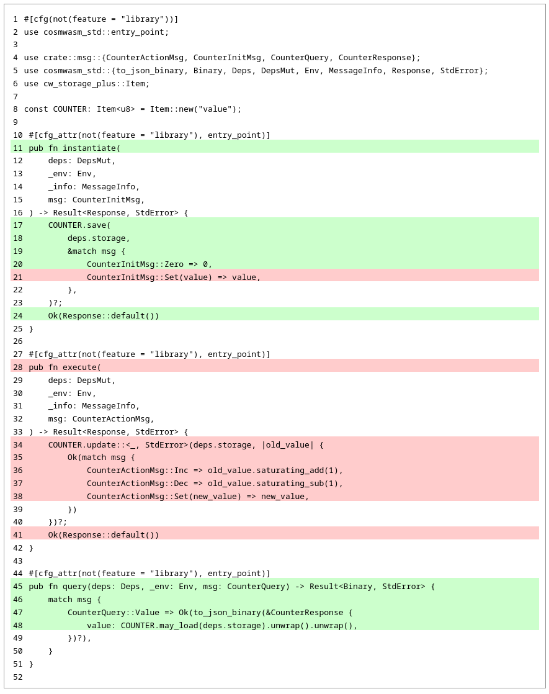
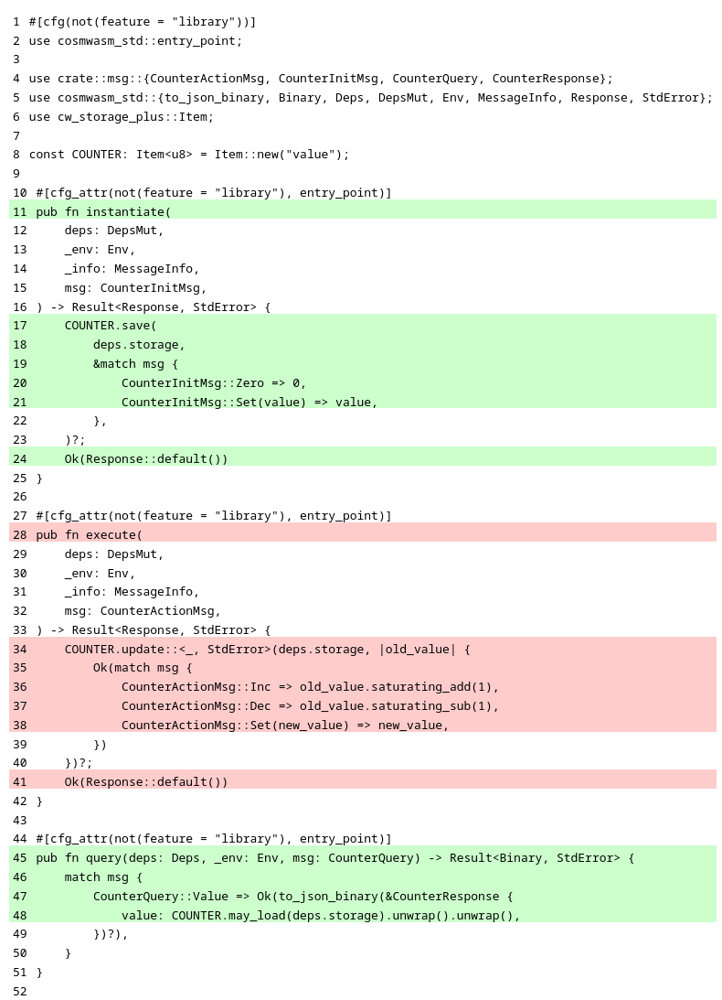
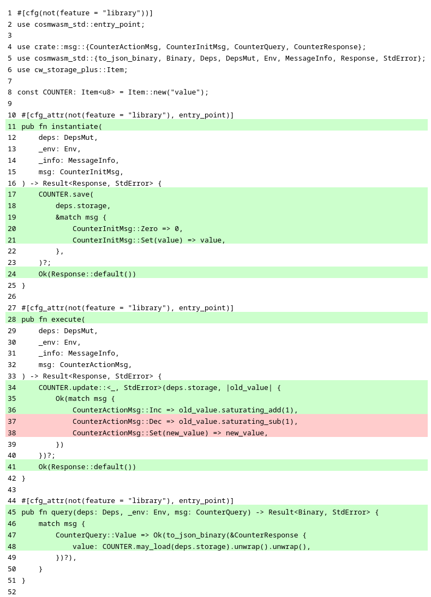

# Writing tests in CosmWasm

```rust copy
use cosmwasm_std::Empty;
use counter::msg::{CounterActionMsg, CounterInitMsg, CounterQuery, CounterResponse};
use cw_multi_test::{App, Contract, ContractWrapper, Executor, IntoAddr};

fn counter_contract() -> Box<dyn Contract<Empty>> {
    Box::new(ContractWrapper::new_with_empty(
        counter::contract::execute,
        counter::contract::instantiate,
        counter::contract::query,
    ))
}
```

```rust copy
#[test]
fn instantiating_with_zero_should_work() {
    let mut app = App::default();

    let code_id = app.store_code(counter_contract());
    let owner = "owner".into_addr();

    let contract_addr = app
        .instantiate_contract(
            code_id,
            owner.clone(),
            &CounterInitMsg::Zero,
            &[],
            "counter",
            None,
        )
        .unwrap();

    let res: CounterResponse = app
        .wrap()
        .query_wasm_smart(contract_addr, &CounterQuery::Value)
        .unwrap();

    assert_eq!(0, res.value);
}
```

```shell copy
cargo test
```

```ansi
     Running tests/mod.rs (target/debug/deps/mod-54761c1d31e6d0fe)

running 1 test
test multitest::test_counter::instantiating_with_zero_should_work ... ok

test result: ok. 1 passed; 0 failed; 0 ignored; 0 measured; 0 filtered out; finished in 0.00s
```

```shell copy
cargo nextest run
```

```ansi
    Starting 1 test across 2 binaries (run ID: c83e5f6c-a237-4eb2-a9af-7b064de231d7, nextest profile: default)
        PASS [   0.004s] counter::mod multitest::test_counter::instantiating_with_zero_should_work
------------
     Summary [   0.005s] 1 test run: 1 passed, 0 skipped
```

```shell
./coverage.sh
```

```ansi
|| Tested/Total Lines:
|| src/contract.rs: 10/18 +55.56%
||
55.56% coverage, 10/18 lines covered, +55.56% change in coverage
```



```rust copy
#[test]
fn instantiating_with_value_should_work() {
    let mut app = App::default();

    let code_id = app.store_code(counter_contract());
    let owner = "owner".into_addr();

    let contract_addr = app
        .instantiate_contract(
            code_id,
            owner.clone(),
            &CounterInitMsg::Set(12),
            &[],
            "counter",
            None,
        )
        .unwrap();

    let res: CounterResponse = app
        .wrap()
        .query_wasm_smart(contract_addr, &CounterQuery::Value)
        .unwrap();

    assert_eq!(12, res.value);
}
```

```shell copy
cargo nextest run
```

```ansi
    Starting 2 tests across 2 binaries (run ID: be1434a3-37f5-4a84-8cd7-bd999780ccd9, nextest profile: default)
        PASS [   0.004s] counter::mod multitest::test_counter::instantiating_with_zero_should_work
        PASS [   0.005s] counter::mod multitest::test_counter::instantiating_with_value_should_work
------------
     Summary [   0.005s] 2 tests run: 2 passed, 0 skipped
```

```shell
./coverage.sh
```

```ansi
|| Tested/Total Lines:
|| src/contract.rs: 11/18 +61.11%
||
61.11% coverage, 11/18 lines covered, +61.11% change in coverage
```

<details>
  <summary>Detailed code coverage report</summary>
  
</details>

```rust copy
#[test]
fn incrementing_should_work() {
    let mut app = App::default();

    let code_id = app.store_code(counter_contract());
    let owner = "owner".into_addr();

    let contract_addr = app
        .instantiate_contract(
            code_id,
            owner.clone(),
            &CounterInitMsg::Zero,
            &[],
            "counter",
            None,
        )
        .unwrap();

    app.execute_contract(owner, contract_addr.clone(), &CounterActionMsg::Inc, &[])
        .unwrap();

    let res: CounterResponse = app
        .wrap()
        .query_wasm_smart(contract_addr, &CounterQuery::Value)
        .unwrap();

    assert_eq!(1, res.value);
}
```

<details>
  <summary>Tests and code coverage</summary>
```shell copy
cargo nextest run
````

```ansi
    Starting 3 tests across 2 binaries (run ID: 1cc52bb8-f198-4c7e-9bd4-14295d64662b, nextest profile: default)
        PASS [   0.004s] counter::mod multitest::test_counter::instantiating_with_value_should_work
        PASS [   0.004s] counter::mod multitest::test_counter::instantiating_with_zero_should_work
        PASS [   0.005s] counter::mod multitest::test_counter::incrementing_should_work
------------
     Summary [   0.005s] 3 tests run: 3 passed, 0 skipped
```

```shell copy
./coverage.sh
```

```ansi
|| Tested/Total Lines:
|| src/contract.rs: 16/18 +27.78%
||
88.89% coverage, 16/18 lines covered, +27.78% change in coverage
```



</details>

```rust copy
#[test]
fn incrementing_should_stop_at_maximum() {
    let mut app = App::default();

    let code_id = app.store_code(counter_contract());
    let owner = "owner".into_addr();

    let contract_addr = app
        .instantiate_contract(
            code_id,
            owner.clone(),
            &CounterInitMsg::Set(250),
            &[],
            "counter",
            None,
        )
        .unwrap();

    for _ in 1..=10 {
        app.execute_contract(
            owner.clone(),
            contract_addr.clone(),
            &CounterActionMsg::Inc,
            &[],
        )
        .unwrap();
    }

    let res: CounterResponse = app
        .wrap()
        .query_wasm_smart(contract_addr, &CounterQuery::Value)
        .unwrap();

    assert_eq!(255, res.value);
}
```

```shell copy
cargo nextest run
```

```ansi
    Starting 4 tests across 2 binaries (run ID: 893d0a87-f26b-4e32-abb6-a1172c42d93e, nextest profile: default)
        PASS [   0.004s] counter::mod multitest::test_counter::instantiating_with_zero_should_work
        PASS [   0.005s] counter::mod multitest::test_counter::incrementing_should_work
        PASS [   0.004s] counter::mod multitest::test_counter::instantiating_with_value_should_work
        PASS [   0.005s] counter::mod multitest::test_counter::incrementing_should_stop_at_maximum
------------
     Summary [   0.005s] 4 tests run: 4 passed, 0 skipped
```

```shell copy
./coverage.sh
```

```ansi
|| Tested/Total Lines:
|| src/contract.rs: 16/18 +0.00%
||
88.89% coverage, 16/18 lines covered, +0.00% change in coverage
```

```rust copy
#[test]
fn decrementing_should_work() {
    let mut app = App::default();

    let code_id = app.store_code(counter_contract());
    let owner = "owner".into_addr();

    let contract_addr = app
        .instantiate_contract(
            code_id,
            owner.clone(),
            &CounterInitMsg::Set(126),
            &[],
            "counter",
            None,
        )
        .unwrap();

    app.execute_contract(owner, contract_addr.clone(), &CounterActionMsg::Dec, &[])
        .unwrap();

    let res: CounterResponse = app
        .wrap()
        .query_wasm_smart(contract_addr, &CounterQuery::Value)
        .unwrap();

    assert_eq!(125, res.value);
}
```

```rust copy
#[test]
fn decrementing_should_stop_at_minimum() {
    let mut app = App::default();

    let code_id = app.store_code(counter_contract());
    let owner = "owner".into_addr();

    let contract_addr = app
        .instantiate_contract(
            code_id,
            owner.clone(),
            &CounterInitMsg::Set(5),
            &[],
            "counter",
            None,
        )
        .unwrap();

    for _ in 1..=10 {
        app.execute_contract(
            owner.clone(),
            contract_addr.clone(),
            &CounterActionMsg::Dec,
            &[],
        )
        .unwrap();
    }

    let res: CounterResponse = app
        .wrap()
        .query_wasm_smart(contract_addr, &CounterQuery::Value)
        .unwrap();

    assert_eq!(0, res.value);
}
```

```rust copy
#[test]
fn setting_value_should_work() {
    let mut app = App::default();

    let code_id = app.store_code(counter_contract());
    let owner = "owner".into_addr();

    let contract_addr = app
        .instantiate_contract(
            code_id,
            owner.clone(),
            &CounterInitMsg::Set(5),
            &[],
            "counter",
            None,
        )
        .unwrap();

    app.execute_contract(
        owner.clone(),
        contract_addr.clone(),
        &CounterActionMsg::Set(126),
        &[],
    )
    .unwrap();

    let res: CounterResponse = app
        .wrap()
        .query_wasm_smart(contract_addr, &CounterQuery::Value)
        .unwrap();

    assert_eq!(126, res.value);
}
```

## test_counter.rs

```rust copy showLineNumbers filename="test_counter.rs"
use cosmwasm_std::Empty;
use counter::msg::{CounterActionMsg, CounterInitMsg, CounterQuery, CounterResponse};
use cw_multi_test::{App, Contract, ContractWrapper, Executor, IntoAddr};

fn counter_contract() -> Box<dyn Contract<Empty>> {
    Box::new(ContractWrapper::new_with_empty(
        counter::contract::execute,
        counter::contract::instantiate,
        counter::contract::query,
    ))
}

#[test]
fn instantiating_with_zero_should_work() {
    let mut app = App::default();

    let code_id = app.store_code(counter_contract());
    let owner = "owner".into_addr();

    let contract_addr = app
        .instantiate_contract(
            code_id,
            owner.clone(),
            &CounterInitMsg::Zero,
            &[],
            "counter",
            None,
        )
        .unwrap();

    let res: CounterResponse = app
        .wrap()
        .query_wasm_smart(contract_addr, &CounterQuery::Value)
        .unwrap();

    assert_eq!(0, res.value);
}

#[test]
fn instantiating_with_value_should_work() {
    let mut app = App::default();

    let code_id = app.store_code(counter_contract());
    let owner = "owner".into_addr();

    let contract_addr = app
        .instantiate_contract(
            code_id,
            owner.clone(),
            &CounterInitMsg::Set(12),
            &[],
            "counter",
            None,
        )
        .unwrap();

    let res: CounterResponse = app
        .wrap()
        .query_wasm_smart(contract_addr, &CounterQuery::Value)
        .unwrap();

    assert_eq!(12, res.value);
}

#[test]
fn incrementing_should_work() {
    let mut app = App::default();

    let code_id = app.store_code(counter_contract());
    let owner = "owner".into_addr();

    let contract_addr = app
        .instantiate_contract(
            code_id,
            owner.clone(),
            &CounterInitMsg::Zero,
            &[],
            "counter",
            None,
        )
        .unwrap();

    app.execute_contract(owner, contract_addr.clone(), &CounterActionMsg::Inc, &[])
        .unwrap();

    let res: CounterResponse = app
        .wrap()
        .query_wasm_smart(contract_addr, &CounterQuery::Value)
        .unwrap();

    assert_eq!(1, res.value);
}

#[test]
fn incrementing_should_stop_at_maximum() {
    let mut app = App::default();

    let code_id = app.store_code(counter_contract());
    let owner = "owner".into_addr();

    let contract_addr = app
        .instantiate_contract(
            code_id,
            owner.clone(),
            &CounterInitMsg::Set(250),
            &[],
            "counter",
            None,
        )
        .unwrap();

    for _ in 1..=10 {
        app.execute_contract(
            owner.clone(),
            contract_addr.clone(),
            &CounterActionMsg::Inc,
            &[],
        )
        .unwrap();
    }

    let res: CounterResponse = app
        .wrap()
        .query_wasm_smart(contract_addr, &CounterQuery::Value)
        .unwrap();

    assert_eq!(255, res.value);
}

#[test]
fn decrementing_should_work() {
    let mut app = App::default();

    let code_id = app.store_code(counter_contract());
    let owner = "owner".into_addr();

    let contract_addr = app
        .instantiate_contract(
            code_id,
            owner.clone(),
            &CounterInitMsg::Set(126),
            &[],
            "counter",
            None,
        )
        .unwrap();

    app.execute_contract(owner, contract_addr.clone(), &CounterActionMsg::Dec, &[])
        .unwrap();

    let res: CounterResponse = app
        .wrap()
        .query_wasm_smart(contract_addr, &CounterQuery::Value)
        .unwrap();

    assert_eq!(125, res.value);
}

#[test]
fn decrementing_should_stop_at_minimum() {
    let mut app = App::default();

    let code_id = app.store_code(counter_contract());
    let owner = "owner".into_addr();

    let contract_addr = app
        .instantiate_contract(
            code_id,
            owner.clone(),
            &CounterInitMsg::Set(5),
            &[],
            "counter",
            None,
        )
        .unwrap();

    for _ in 1..=10 {
        app.execute_contract(
            owner.clone(),
            contract_addr.clone(),
            &CounterActionMsg::Dec,
            &[],
        )
        .unwrap();
    }

    let res: CounterResponse = app
        .wrap()
        .query_wasm_smart(contract_addr, &CounterQuery::Value)
        .unwrap();

    assert_eq!(0, res.value);
}

#[test]
fn setting_value_should_work() {
    let mut app = App::default();

    let code_id = app.store_code(counter_contract());
    let owner = "owner".into_addr();

    let contract_addr = app
        .instantiate_contract(
            code_id,
            owner.clone(),
            &CounterInitMsg::Set(5),
            &[],
            "counter",
            None,
        )
        .unwrap();

    app.execute_contract(
        owner.clone(),
        contract_addr.clone(),
        &CounterActionMsg::Set(126),
        &[],
    )
    .unwrap();

    let res: CounterResponse = app
        .wrap()
        .query_wasm_smart(contract_addr, &CounterQuery::Value)
        .unwrap();

    assert_eq!(126, res.value);
}
```
