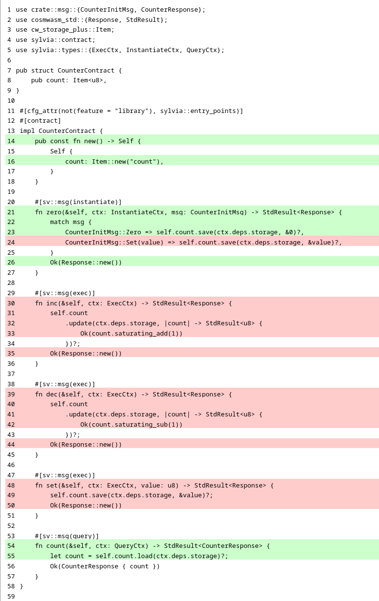
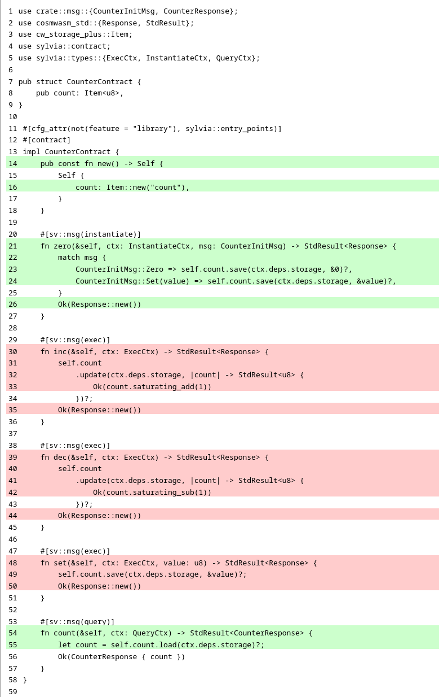
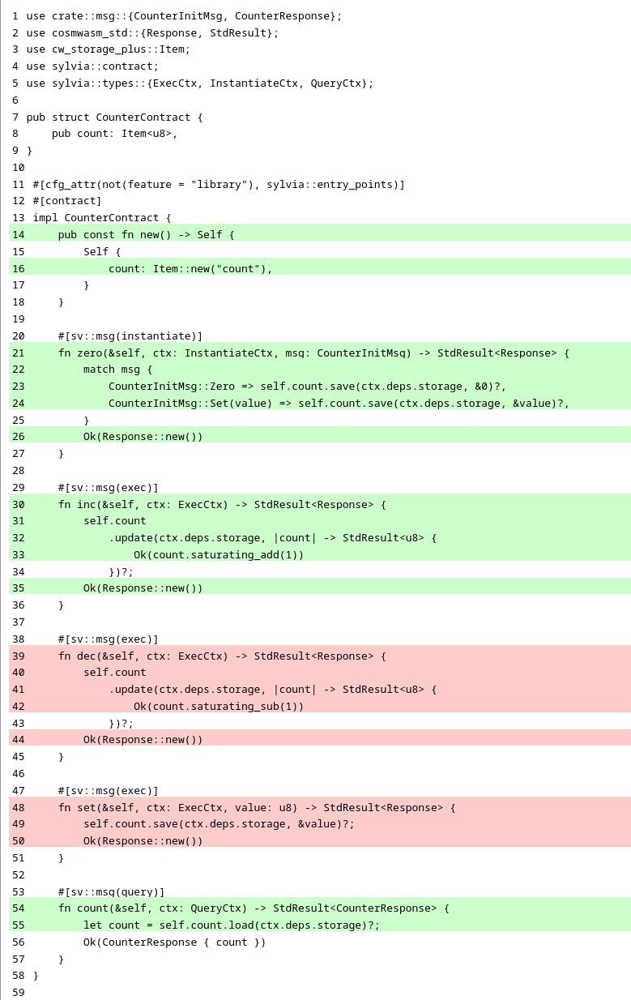
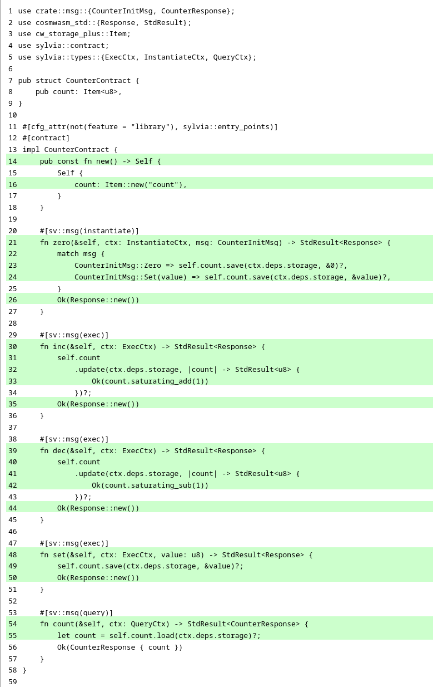

import { Callout, Card, Cards, Steps } from "nextra/components";

# Writing tests in Sylvia

As a reminder, the file structure of the **counter** project is shown below. In this chapter, you
will be writing tests for this smart contract, which will be placed in a file named
`test_counter.rs`, highlighted in **line 12**.

```ansi {12} showLineNumbers filename="counter (directory)"
.
├── Cargo.toml
├── coverage.sh
├── src
│   ├── contract.rs
│   ├── lib.rs
│   └── msg.rs
└── tests
    ├── mod.rs
    └── multitest
        ├── mod.rs
        └── test_counter.rs
```

<Callout emoji="🏃">
  If you're in a hurry, at the end of this chapter, you can find the [full
  version](#test-cases-put-all-together) of the `test_counter.rs` file. Just copy and paste its
  content and run all tests.
</Callout>

## Imports

```rust copy showLineNumbers filename="test_counter.rs"
use counter::contract::sv::mt::{CodeId, CounterContractProxy};
use counter::msg::CounterInitMsg;
use sylvia::cw_multi_test::IntoAddr;
use sylvia::multitest::App;
```

## Testing counter initialization

### Testing initialization with zero

```rust copy showLineNumbers{6} filename="test_counter.rs"
#[test]
fn instantiating_with_zero_should_work() {
    let app = App::default();

    let code_id = CodeId::store_code(&app);

    let owner = "owner".into_addr();

    let contract = code_id
        .instantiate(CounterInitMsg::Zero)
        .call(&owner)
        .unwrap();

    assert_eq!(0, contract.count().unwrap().count);
}
```

Having the first test case ready, let's run it:

```shell copy filename="TERMINAL"
cargo test
```

```ansi filename="OUTPUT"
     Running tests/mod.rs (target/debug/deps/mod-a819a838d5b2d67d)

running 1 test
test multitest::test_counter::instantiating_with_zero_should_work ... ok

test result: ok. 1 passed; 0 failed; 0 ignored; 0 measured; 0 filtered out; finished in 0.00s
```

```shell copy filename="TERMINAL"
cargo nextest run
```

```ansi filename="OUTPUT"
    Finished `test` profile [unoptimized + debuginfo] target(s) in 27.67s
    Starting 1 test across 2 binaries (run ID: b2a72818-8d25-4194-9333-3af93c360132, nextest profile: default)
        PASS [   0.004s] counter::mod multitest::test_counter::instantiating_with_zero_should_work
------------
     Summary [   0.004s] 1 test run: 1 passed, 0 skipped
```

```shell copy filename="TERMINAL"
./coverage.sh
```

```ansi filename="OUTPUT"
|| Tested/Total Lines:
|| src/contract.rs: 8/22
||
36.36% coverage, 8/22 lines covered
```

<details>
  <summary>📃  Code coverage report</summary>
  
</details>

#### Detailed explanation

<Cards>
  <Card
    title="🦘  Skip this time"
    href="#testing-initialization-with-a-specific-value"
    icon=""
    children=""
  />
</Cards>

(todo: extremely detailed explanation)

### Testing initialization with a specific value

```rust copy showLineNumbers{22} filename="test_counter.rs"
#[test]
fn instantiating_with_value_should_work() {
    let app = App::default();

    let code_id = CodeId::store_code(&app);

    let owner = "owner".into_addr();

    let contract = code_id
        .instantiate(CounterInitMsg::Set(12))
        .call(&owner)
        .unwrap();

    assert_eq!(12, contract.count().unwrap().count);
}
```

```shell copy filename="TERMINAL"
cargo test
```

```ansi filename="OUTPUT"
     Running tests/mod.rs (target/debug/deps/mod-a819a838d5b2d67d)

running 2 tests
test multitest::test_counter::instantiating_with_zero_should_work ... ok
test multitest::test_counter::instantiating_with_value_should_work ... ok

test result: ok. 2 passed; 0 failed; 0 ignored; 0 measured; 0 filtered out; finished in 0.00s
```

```shell copy filename="TERMINAL"
./coverage.sh
```

```ansi filename="OUTPUT"
|| Tested/Total Lines:
|| src/contract.rs: 9/22
||
40.91% coverage, 9/22 lines covered
```

<details>
  <summary>📃  Code coverage report</summary>
  
</details>

#### Detailed explanation

<Cards>
  <Card title="🦘  Skip this time" href="#testing-increment-by-1" icon="" children="" />
</Cards>

(todo: extremely detailed explanation)

## Testing counter increment

### Testing increment by 1

```rust copy showLineNumbers{38} filename="test_counter.rs"
#[test]
fn incrementing_should_work() {
    let app = App::default();

    let code_id = CodeId::store_code(&app);

    let owner = "owner".into_addr();

    let contract = code_id
        .instantiate(CounterInitMsg::Zero)
        .call(&owner)
        .unwrap();

    contract.inc().call(&owner).unwrap();

    assert_eq!(1, contract.count().unwrap().count);
}
```

```shell copy filename="TERMINAL"
cargo test
```

```ansi filename="OUTPUT"
     Running tests/mod.rs (target/debug/deps/mod-a819a838d5b2d67d)

running 3 tests
test multitest::test_counter::instantiating_with_zero_should_work ... ok
test multitest::test_counter::instantiating_with_value_should_work ... ok
test multitest::test_counter::incrementing_should_work ... ok

test result: ok. 3 passed; 0 failed; 0 ignored; 0 measured; 0 filtered out; finished in 0.00s
```

```shell copy filename="TERMINAL"
./coverage.sh
```

```ansi filename="OUTPUT"
|| Tested/Total Lines:
|| src/contract.rs: 14/22
||
63.64% coverage, 14/22 lines covered
```

<details>
  <summary>📃  Code coverage report</summary>
  
</details>

#### Detailed explanation

<Cards>
  <Card title="🦘  Skip this time" href="#testing-increment-overflow" icon="" children="" />
</Cards>

(todo: extremely detailed explanation)

### Testing increment overflow

```rust copy showLineNumbers{56} filename="test_counter.rs"
#[test]
fn incrementing_should_stop_at_maximum() {
    let app = App::default();

    let code_id = CodeId::store_code(&app);

    let owner = "owner".into_addr();

    let contract = code_id
        .instantiate(CounterInitMsg::Set(250))
        .call(&owner)
        .unwrap();

    for _ in 1..=10 {
        contract.inc().call(&owner).unwrap();
    }

    assert_eq!(255, contract.count().unwrap().count);
}
```

```shell copy filename="TERMINAL"
cargo test
```

```ansi filename="OUTPUT"
     Running tests/mod.rs (target/debug/deps/mod-a819a838d5b2d67d)

running 4 tests
test multitest::test_counter::instantiating_with_zero_should_work ... ok
test multitest::test_counter::instantiating_with_value_should_work ... ok
test multitest::test_counter::incrementing_should_work ... ok
test multitest::test_counter::incrementing_should_stop_at_maximum ... ok

test result: ok. 4 passed; 0 failed; 0 ignored; 0 measured; 0 filtered out; finished in 0.00s
```

```shell copy filename="TERMINAL"
./coverage.sh
```

```ansi filename="OUTPUT"
|| Tested/Total Lines:
|| src/contract.rs: 14/22
||
63.64% coverage, 14/22 lines covered
```

<details>
  <summary>📃  Code coverage report</summary>
  
</details>

#### Detailed explanation

<Cards>
  <Card title="🦘  Skip this time" href="#testing-decrement-by-1" icon="" children="" />
</Cards>

(todo: extremely detailed explanation)

## Testing counter decrement

### Testing decrement by 1

```rust copy showLineNumbers{76} filename="test_counter.rs"
#[test]
fn decrementing_should_work() {
    let app = App::default();

    let code_id = CodeId::store_code(&app);

    let owner = "owner".into_addr();

    let contract = code_id
        .instantiate(CounterInitMsg::Set(126))
        .call(&owner)
        .unwrap();

    contract.dec().call(&owner).unwrap();

    assert_eq!(125, contract.count().unwrap().count);
}
```

```shell copy filename="TERMINAL"
cargo test
```

```ansi filename="OUTPUT"
     Running tests/mod.rs (target/debug/deps/mod-a819a838d5b2d67d)

running 5 tests
test multitest::test_counter::instantiating_with_zero_should_work ... ok
test multitest::test_counter::instantiating_with_value_should_work ... ok
test multitest::test_counter::incrementing_should_work ... ok
test multitest::test_counter::incrementing_should_stop_at_maximum ... ok
test multitest::test_counter::decrementing_should_work ... ok

test result: ok. 5 passed; 0 failed; 0 ignored; 0 measured; 0 filtered out; finished in 0.00s
```

```shell copy filename="TERMINAL"
./coverage.sh
```

```ansi filename="OUTPUT"
|| Tested/Total Lines:
|| src/contract.rs: 19/22
||
86.36% coverage, 19/22 lines covered
```

<details>
  <summary>📃  Code coverage report</summary>
  
</details>

#### Detailed explanation

<Cards>
  <Card title="🦘  Skip this time" href="#testing-decrement-underflow" icon="" children="" />
</Cards>

(todo: extremely detailed explanation)

### Testing decrement underflow

```rust copy showLineNumbers{94} filename="test_counter.rs"
#[test]
fn decrementing_should_stop_at_minimum() {
    let app = App::default();

    let code_id = CodeId::store_code(&app);

    let owner = "owner".into_addr();

    let contract = code_id
        .instantiate(CounterInitMsg::Set(5))
        .call(&owner)
        .unwrap();

    for _ in 1..=10 {
        contract.dec().call(&owner).unwrap();
    }

    assert_eq!(0, contract.count().unwrap().count);
}
```

```shell copy filename="TERMINAL"
cargo test
```

```ansi filename="OUTPUT"
     Running tests/mod.rs (target/debug/deps/mod-a819a838d5b2d67d)

running 6 tests
test multitest::test_counter::instantiating_with_zero_should_work ... ok
test multitest::test_counter::instantiating_with_value_should_work ... ok
test multitest::test_counter::incrementing_should_work ... ok
test multitest::test_counter::incrementing_should_stop_at_maximum ... ok
test multitest::test_counter::decrementing_should_work ... ok
test multitest::test_counter::decrementing_should_stop_at_minimum ... ok

test result: ok. 6 passed; 0 failed; 0 ignored; 0 measured; 0 filtered out; finished in 0.00s
```

```shell copy filename="TERMINAL"
./coverage.sh
```

```ansi filename="OUTPUT"
|| Tested/Total Lines:
|| src/contract.rs: 19/22
||
86.36% coverage, 19/22 lines covered
```

<details>
  <summary>📃  Code coverage report</summary>
  
</details>

#### Detailed explanation

<Cards>
  <Card title="🦘  Skip this time" href="#testing-counter-value-changes" icon="" children="" />
</Cards>

(todo: extremely detailed explanation)

## Testing counter value changes

```rust copy showLineNumbers{114} filename="test_counter.rs"
#[test]
fn setting_value_should_work() {
    let app = App::default();

    let code_id = CodeId::store_code(&app);

    let owner = "owner".into_addr();

    let contract = code_id
        .instantiate(CounterInitMsg::Set(5))
        .call(&owner)
        .unwrap();

    contract.set(125).call(&owner).unwrap();

    assert_eq!(125, contract.count().unwrap().count);
}
```

```shell copy filename="TERMINAL"
cargo test
```

```ansi filename="OUTPUT"
     Running tests/mod.rs (target/debug/deps/mod-a819a838d5b2d67d)

running 7 tests
test multitest::test_counter::instantiating_with_zero_should_work ... ok
test multitest::test_counter::instantiating_with_value_should_work ... ok
test multitest::test_counter::incrementing_should_work ... ok
test multitest::test_counter::incrementing_should_stop_at_maximum ... ok
test multitest::test_counter::decrementing_should_work ... ok
test multitest::test_counter::decrementing_should_stop_at_minimum ... ok
test multitest::test_counter::setting_value_should_work ... ok

test result: ok. 7 passed; 0 failed; 0 ignored; 0 measured; 0 filtered out; finished in 0.00s
```

```shell copy filename="TERMINAL"
./coverage.sh
```

```ansi filename="OUTPUT"
|| Tested/Total Lines:
|| src/contract.rs: 22/22
||
100.00% coverage, 22/22 lines covered
```

<details>
  <summary>📃  Code coverage report</summary>
  
</details>

#### Detailed explanation

<Cards>
  <Card title="🦘  Skip this time" href="#test-cases-put-all-together" icon="" children="" />
</Cards>

(todo: extremely detailed explanation)

## Test cases put all together

Below is the final content of the `test_counter.rs` file, containing all previously presented test
cases for smart contract written in Sylvia.

```rust copy showLineNumbers filename="test_counter.rs"
use counter::contract::sv::mt::{CodeId, CounterContractProxy};
use counter::msg::CounterInitMsg;
use sylvia::cw_multi_test::IntoAddr;
use sylvia::multitest::App;

#[test]
fn instantiating_with_zero_should_work() {
    let app = App::default();

    let code_id = CodeId::store_code(&app);

    let owner = "owner".into_addr();

    let contract = code_id
        .instantiate(CounterInitMsg::Zero)
        .call(&owner)
        .unwrap();

    assert_eq!(0, contract.count().unwrap().count);
}

#[test]
fn instantiating_with_value_should_work() {
    let app = App::default();

    let code_id = CodeId::store_code(&app);

    let owner = "owner".into_addr();

    let contract = code_id
        .instantiate(CounterInitMsg::Set(12))
        .call(&owner)
        .unwrap();

    assert_eq!(12, contract.count().unwrap().count);
}

#[test]
fn incrementing_should_work() {
    let app = App::default();

    let code_id = CodeId::store_code(&app);

    let owner = "owner".into_addr();

    let contract = code_id
        .instantiate(CounterInitMsg::Zero)
        .call(&owner)
        .unwrap();

    contract.inc().call(&owner).unwrap();

    assert_eq!(1, contract.count().unwrap().count);
}

#[test]
fn incrementing_should_stop_at_maximum() {
    let app = App::default();

    let code_id = CodeId::store_code(&app);

    let owner = "owner".into_addr();

    let contract = code_id
        .instantiate(CounterInitMsg::Set(250))
        .call(&owner)
        .unwrap();

    for _ in 1..=10 {
        contract.inc().call(&owner).unwrap();
    }

    assert_eq!(255, contract.count().unwrap().count);
}

#[test]
fn decrementing_should_work() {
    let app = App::default();

    let code_id = CodeId::store_code(&app);

    let owner = "owner".into_addr();

    let contract = code_id
        .instantiate(CounterInitMsg::Set(126))
        .call(&owner)
        .unwrap();

    contract.dec().call(&owner).unwrap();

    assert_eq!(125, contract.count().unwrap().count);
}

#[test]
fn decrementing_should_stop_at_minimum() {
    let app = App::default();

    let code_id = CodeId::store_code(&app);

    let owner = "owner".into_addr();

    let contract = code_id
        .instantiate(CounterInitMsg::Set(5))
        .call(&owner)
        .unwrap();

    for _ in 1..=10 {
        contract.dec().call(&owner).unwrap();
    }

    assert_eq!(0, contract.count().unwrap().count);
}

#[test]
fn setting_value_should_work() {
    let app = App::default();

    let code_id = CodeId::store_code(&app);

    let owner = "owner".into_addr();

    let contract = code_id
        .instantiate(CounterInitMsg::Set(5))
        .call(&owner)
        .unwrap();

    contract.set(125).call(&owner).unwrap();

    assert_eq!(125, contract.count().unwrap().count);
}
```

## Test cases summary

(todo: find the best place for this)

<Steps>
  ### Initialize the chain

(todo)

### Store contract's code on chain

(todo)

### Initialize the contract

(todo)

### Interact with the contract

(todo)

### Assert expected results

(todo)

</Steps>
