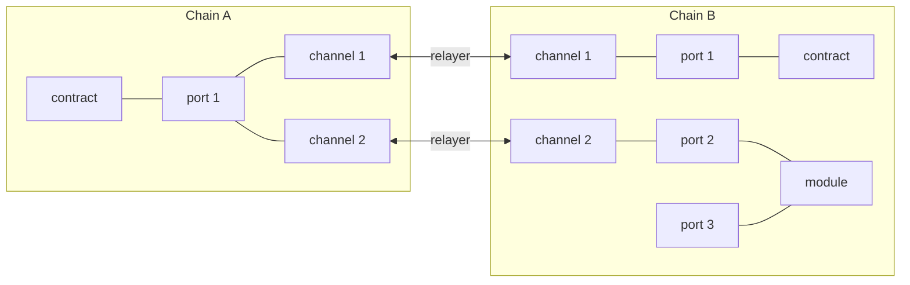

## Basic Concepts

In order to understand how IBC works, it is important to understand some basic concepts:

- **Port**: Every instantiation of an ibc-enabled contract creates a unique port, similarly to how
  it creates a unique address. Native Cosmos SDK modules can also have one or multiple unique ports.
- **Channel**: A connection between two ports on different blockchains that allows them to send
  packets to each other. Each port can have multiple channels.
- **Packet**: A piece of binary data that is sent through a channel. It can time out if it is not
  delivered within a certain time frame.
- **Relayer**: An off-chain service that is responsible for passing packets between blockchains. The
  relayer watches for new packet commitments on one chain and submits them to the other chain. This
  is the way in which your packets actually reach the other chain. Anyone can run a relayer.

Here's an example diagram of how these concepts are related:

We will go into more detail on how these concepts are related to CosmWasm in the later sections, but
this should give you some basic terminology to start with. If you want to learn more about IBC, you
can read the [IBC specification] or check out the [IBC documentation].

[IBC specification]: https://github.com/cosmos/ibc
[IBC documentation]: https://ibc.cosmos.network/main
