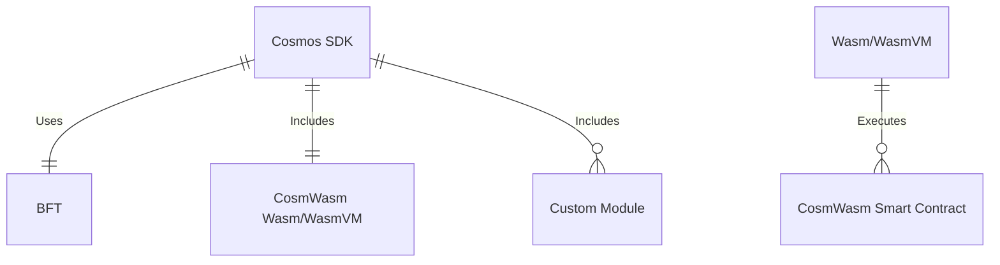

The [x/wasm module](https://github.com/CosmWasm/wasmd/tree/main/x/wasm), the root of CosmWasm, is a
[Cosmos SDK](https://docs.cosmos.network/) module enabling smart contracts to execute on the
[Wasmer](https://wasmer.io/) virtual machine. It is a bridge between Cosmos chain and the
[WasmVM](https://github.com/CosmWasm/wasmvm) executing the smart contracts. CosmWasm itself is the
whole ecosystem built around it with a mission to make smart contracts development easy and
reliable. The focuses of the CosmWasm platform are security, performance, and interoperability.

We chose to target a Rust programming language as a smart contract development stack, as it has the
best Wasm compiler on the market so far. We do not provide bindings to help write smart contracts in
another stack that compiles to Wasm, and we don't support that.

Here is where to find CosmWasm in the whole Cosmos stack:

The important thing about CosmWasm smart contracts is their transparency. Every smart contract
instance has its unique address on the chain, and it can act just like any other chain client. It is
easy to implement communication between two smart contracts on the same chain. CosmWasm standard
library provides simple utilities to communicate with non-CosmWasm modules on the chain. That
includes common Cosmos modules like bank or staking and any custom module unique for a particular
chain. Finally, CosmWasm is built around the [IBC](https://www.ibcprotocol.dev/) and provides a
simple API to communicate with other chains and contracts using IBC-based protocols

This documentation already covers most of the stack. Still, some parts are a work in progress. If
there is something you remember being here in the old documentation, you can find its content at
https://github.com/CosmWasm/docs-deprecated. Remember that the old documentation is deprecated,
mostly outdated, and will not be maintained. We would appreciate any GitHub issues about missing
parts in the [documentation repository](https://github.com/CosmWasm/docs).

It is worth noting about additional CosmWasm learning resources:

- [CosmWasm book](https://book.cosmwasm.com/)
- [Sylvia book](https://cosmwasm.github.io/sylvia-book/index.html)
